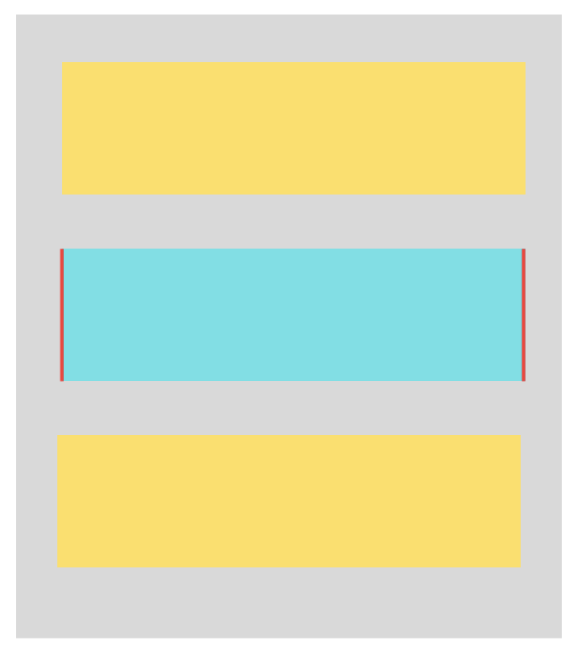
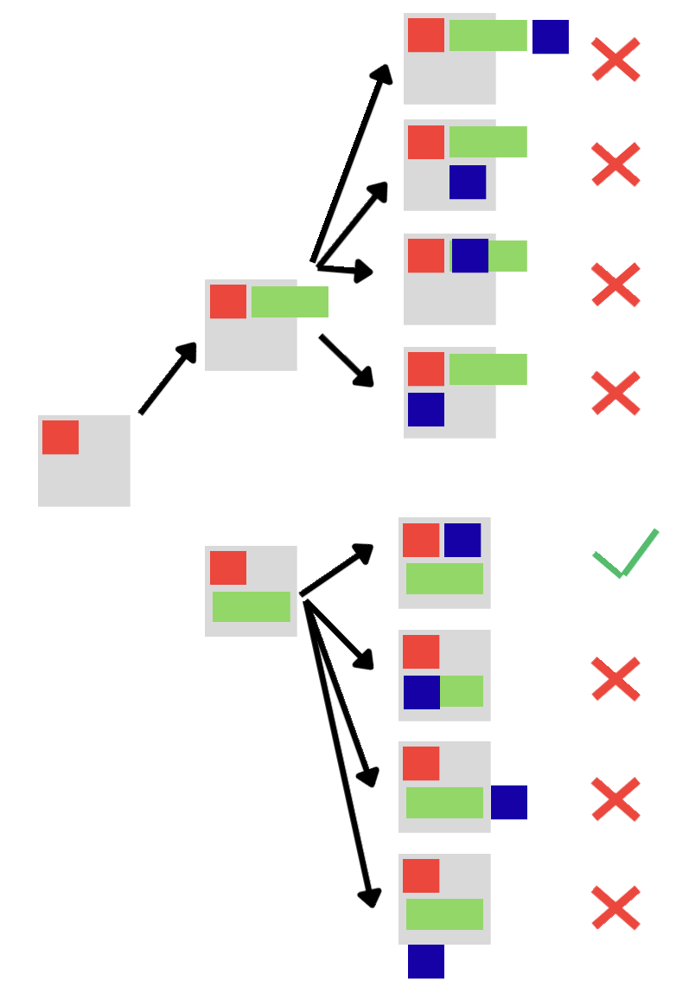

This is a [Next.js](https://nextjs.org) project bootstrapped with [`create-next-app`](https://github.com/vercel/next.js/tree/canary/packages/create-next-app).

## Getting Started

To install dependencies run

```bash
npm install
```

To run the development server, execute:

```bash
npm run dev
```

Open [http://localhost:3000](http://localhost:3000) with your browser to see the page.

## Logic for box placement

* For the initial checks, we make sure that none of the individual boxes with their respective spacing exceed the area of the perimeter.
* Once that is performed, we do a naïve area check. We check the following condition:

	```math
	\sum_{box \in\{A, B, C\}} w_{box}\cdot h_{box} + 2\cdot \min(w_{box}, h_{box})\cdot spacing \leq  \text{perimeter area}
	```
	Where $w_{box}$ and $h_{box}$ are the width and height of the box in question respectively. Our area bounding function ensures that the total area occupied by the boxes, including the minimum spacing required, does not exceed the available perimeter area. The minimum spacing, while not accurate gives us a tight bound on the area. We use $2\cdot \min(w_{box}, h_{box})\cdot spacing$ as the spacing area approximation, as any box can have a minimum of two sides exposed without facing another box (as shown in the image, with exposed sides marked in red).
	
	<p align="center">
		
	</p>

	We can have tighter bounds on this area, but I chose to keep it simple.
* Finally, we do the following with all possible permutations ((A, B, C), (A, C, B), (B, A, C), (B, C, A), (C, A, B), (C, B, A)):

	* We place the first box in the arrangement in the set in the top left corner of the space.
	* After that, we try placing the second box either i) under the first box or ii) on the right of the first box. 
	* Subsequently, we try placing the third box in one of the four positions: i) under the first box ii) under the second box iii) on the right of the first box and iv) on the right of the second box.

	Note that when we place a box B on the right of a box A, (top left coordinate = (x, y), also note that we are talking in terms of the SVG coordinate system), we set `B.x` as `A.x + A.width + spacing` and `B.y` as `A.y`. Similarly, to place B under A, we set `B.x` as `A.x` and `B.y` as `A.y + A.height + spacing`.

	This would cover all possible ways of placing the three boxes, and at least one configuration would provide us a valid configuration.

	We return the first feasible combination after checking for no overlaps.

	<p align="center">
		
	</p>

	We would be checking for 6 permutations x 2 positions for the second box x 4 positions for third box, equalling 48 configurations. We can prune some nodes early to optimize the program, but since there are only 48 configurations, we brute-force through all of them while keeping the code simple.